## 碎碎念

最近代码量多了起来，深受着bug的折磨。磨磨碎碎了几天后，想着要不写一篇（水一期）有关调bug的感受吧。

虽然本期隔了2个月了，欠的上一期等某天自己随手写的项目结果能拿到几千颗星时再补上吧（程序员猝死前的幻想罢了）

## 不是，这咋跑起来的！这咋跑不起来！

常常会在写bug的途中冒出程序来。因此，通过调试去复现，测试，寻找此类状况是必不可少的。常见的调试器有vs自带的调试器，有gdb等这类工具。不过，这些工具都大多会在某些场景上存在局限，比如vs的只能用在window程序上啦，gdb要敲命令行啦，vscode+gdb要配一堆环境啦。有没有一款不吃环境，简单易上手上限高的调试器呢。有的，兄弟有的。可以尝试一下IDA里面的动态调试器。

## IDA

IDA算是网络安全领域中热门，必备的工具，用于逆向，pwd等任务。不过，在我眼里，这可是最好的gdb图形化工具了。（由于进入左脚踏入门所以IDA的动态调试器又卡死了）

## 使用方法
// 下载安装就不说了。

首先, 编译出来的程序是需要带调试信息的。vs就在编译时选择debug进行编译，gcc就弄-O0 -g选项（本人调试时比较喜欢-O0选项）

然后用ida打开，配置好调试器就行，

## 使用技巧

1. 当前函数变量的查看
例如，下面有一个parse_mount_tag函数,其中如果我想查看full_path, mount_tag，open_path。如何通过堆栈视图查看里面的变量

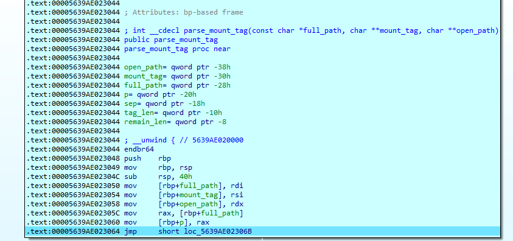

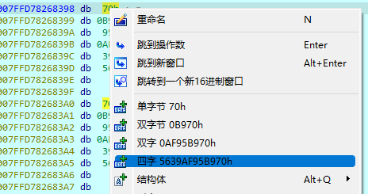

#### 基本操作
##### 拿full_path举例
1. 记住full_path是一个8字节的指针

2. 直接点击
`00005639AE023050 mov     [rbp+full_path], rdi`
里面的rbp+full_path

3.右键四字

现在就能知道指针的值为`5639AF95B970`了

> 单字节为1个字节，双字节为2个字节，双字为4个字节，四字为8字节

#### 指针的指向

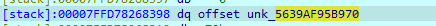

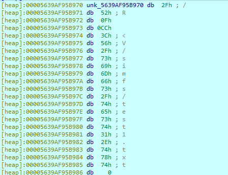
再拿之前的full_path作举例，由于full_path是一个指针。对于指针，可以双击这个指针，直接跳转到指针指向的地址

#### 结构体变量的查看

ctx是一个结构体vfs_file_context_t_0指针，如何方便的查看里面的内容呢
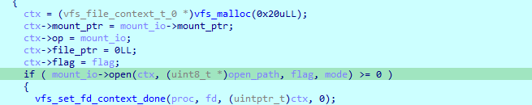

1. 首先，在结构体视图中添加vfs_file_context_t_0结构体(一般ida已经自动添加了，可以直接进入下一步)
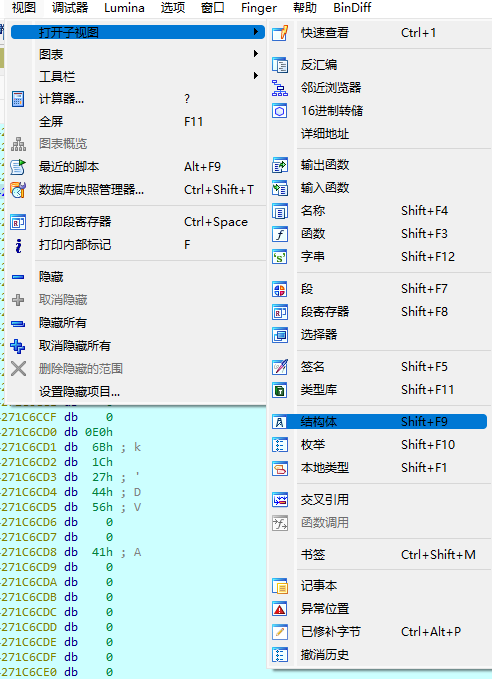
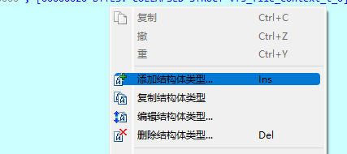

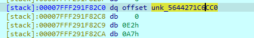
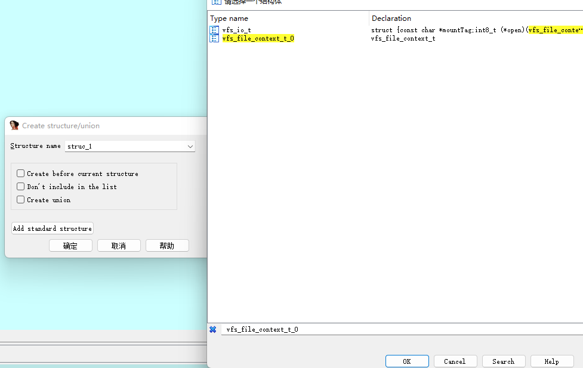

视图->结构体->空白处右键->点击添加结构体类型->Add standard structue->按ctrl+f->输入需要查看的结构体类型名称->双击需要查看的结构体类型名称->完成

2.在堆栈中找到指针值，跳到指针指向的地址，在该地址处按alt+q（不建议通过右键去选择结构体，此处选择的结构体是不全的）
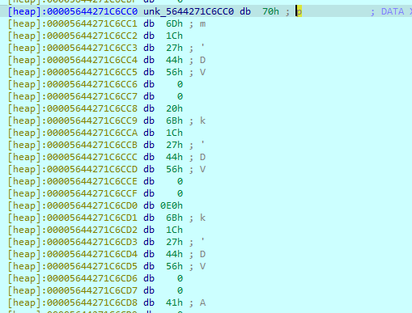
3. 选择结构体（若找不到就跳到第一步），完成
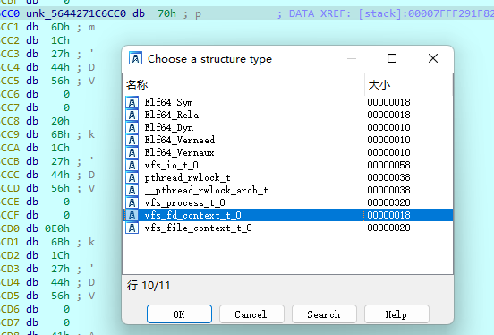

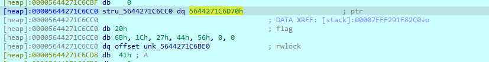

#### 通过堆栈视图查询变量
有些时候，追踪函数调用执行流时，会查看其中一两个函数的变量，由于此时的rbp，rsp已经改变，不能通过汇编视图直接跳转到堆栈里面去。此时就只能手算堆栈了。

例如，我想查看vfs_write里面的变量，然而此时的rbp, rsp的环境是在vfs_process_read函数里，如何查看vfs_write的变量
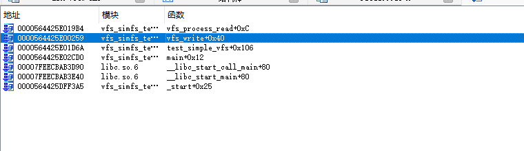

根据x64的规范，进入一个函数后，就会先压一个函数返回地址和rbp
反过来，我们先寻找到这个函数返回地址，就能定位到原本的变量位置
由此，可以采取下列的方法

1. 在堆栈视图中寻找到vfs_write的返回地址，与vfs_write的调用函数返回地址（也就是vfs_write前一个函数test_simpple_vfs）
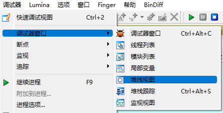
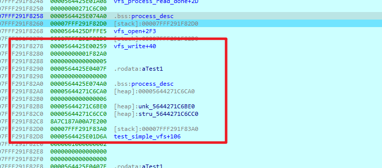

2. 在汇编视图中记录好ida反汇编出来的变量的所在位置，
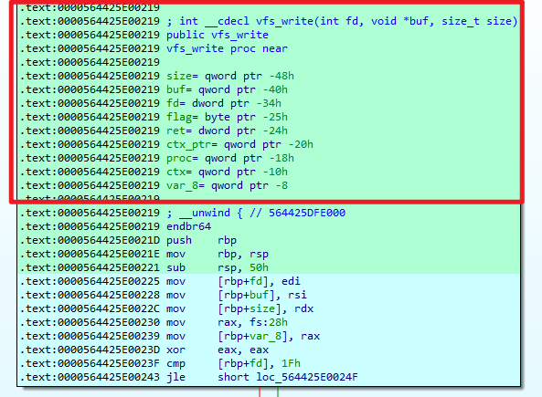

3. 根据vfs_write的调用函数返回地址进行推断，（根据第二步的位置进行判断，-8为第二格，-10h为第三格，-18h为第四格，-20h为第5格），和变量的所在位置对应好就行

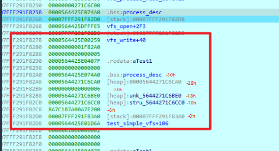

## 总结

ida还有交叉引用，dump为c、python数组，修补啥的功能太多就不讲了。总之真香。

