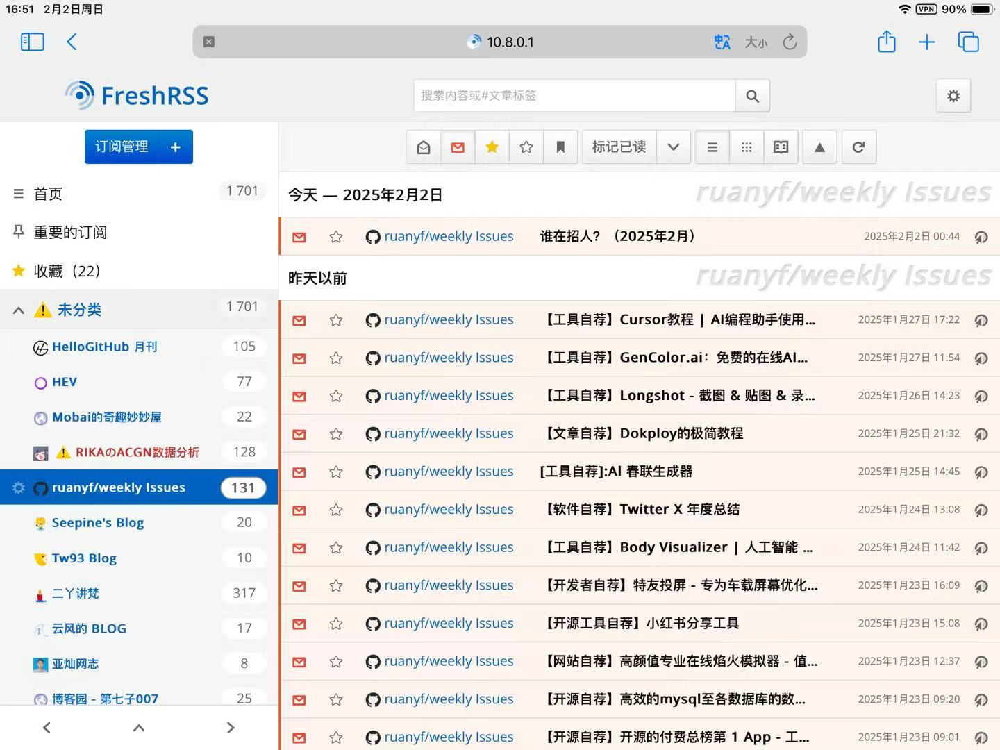
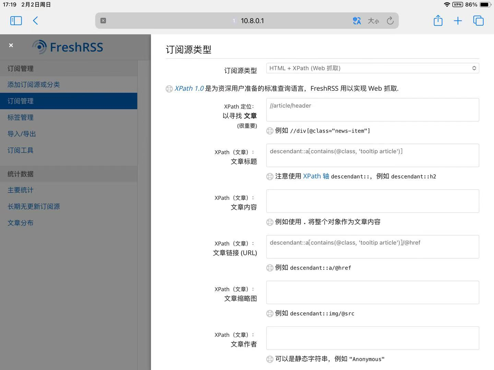
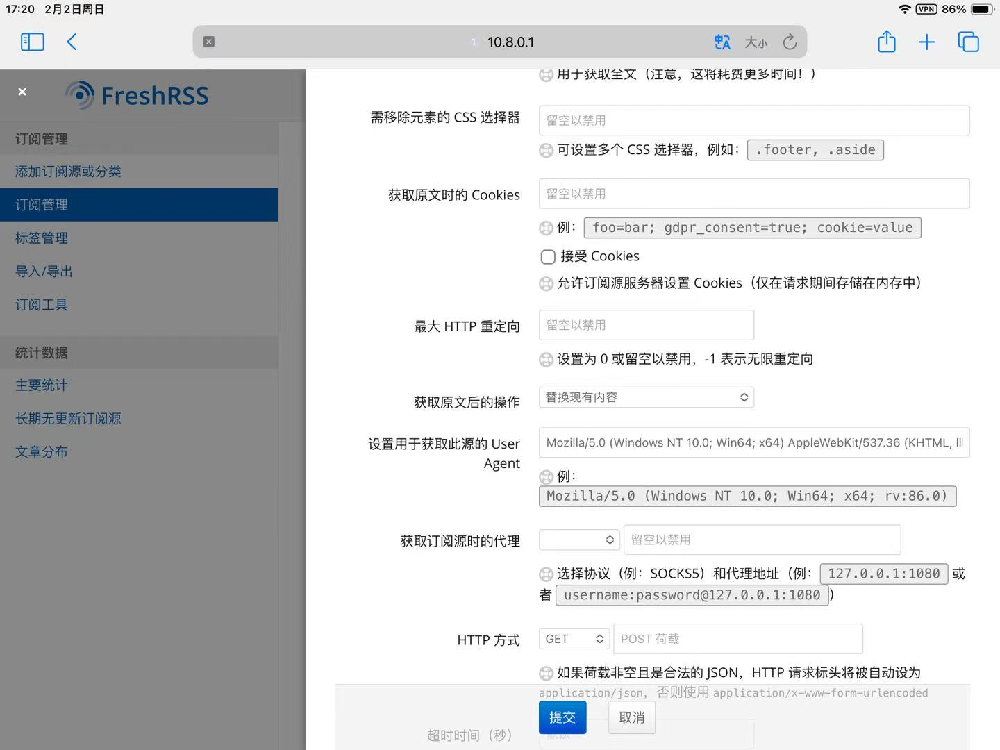
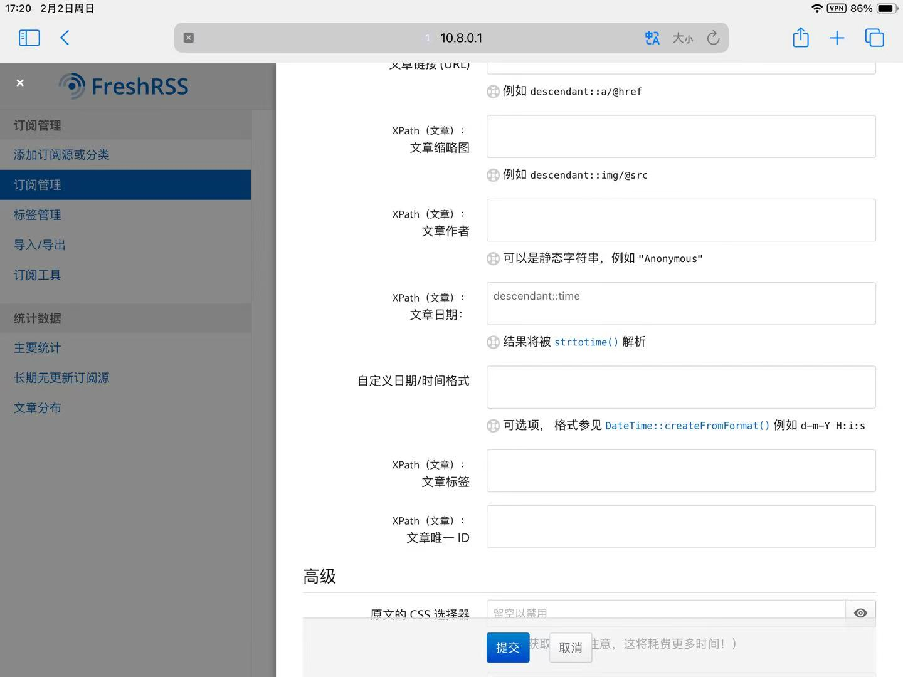

第2期 - 资讯，RSS与信息茧房

## 本期要点
- 获取有价值，有意义，有趣的文章，资讯
- 通过freshrss，readyou自建资讯类app
- 通过freshrss爬取网站
- 搭建rsshub爬取github等热门网站
- 另一类的信息茧房？

## 接触RSS
搜代码搜东西啥的搜多了，总会发现一些比较有创意，有深度的文章。浏览文章的同时，我也很希望能收藏这一个博客。假如将来更新了那自己就能看得了更多。不过，也不是谁有那么多心思天天高强度刷新看有没有更新的。偶然的一次机会，我了解到了RSS，可以在博客更新时接收到更新信息。于是就有了折腾

## RSS与其他资讯类app的不同（这一段写得好乱好杂）
可以说，最大的不同就是，没有算法下的迎合吧。其他资讯类app，推给你的内容都是大数据分析的。大数据认为你是这样，那内容就是这样。自己被动的接受这样的信息，成为大数据认为的这一类人。而rss是需要自己主动去订阅话题，博客，接收到的信息是自己想要希望要的。

## 效果图




## 搭建方式

### freshrss搭建
freshrss拿docker跑就好，下面附上docker-compose脚本
```
services:
  freshrss:
    image: freshrss/freshrss:latest
    container_name: freshrss
    environment:
      - CRON_MIN=*/20       #每20分钟刷新一次
      - TZ=Asia/Shanghai
      - FRESHRSS_INSTALL=--default-user=admin --api-enabled
      - FRESHRSS_USER=--user=admin --api-password=12345678 --password=12345678"    #两个密码要改改
    volumes:
      - ./data:/var/www/FreshRSS/data
      - ./extensions:/var/www/FreshRSS/extensions
    ports:
      - 7753:80        #左边的8080可以改成服务器上没有用过的端口
    depends_on:
      - postgres
    restart: always

  postgres:
    image: postgres:alpine
    container_name: freshrss-postgres
    environment:
      - POSTGRES_USER=freshrss
      - POSTGRES_PASSWORD=freshrss    #密码可以自己修改
      - POSTGRES_DB=freshrss
    volumes:
      - ./freshrss-postgres-data:/var/lib/postgresql/data
    restart: always

```

搭好后就能直接进入freshrss后台了。
随便找一个rss源，把网址填上去就弄好了

### readyou搭建

添加帐户，自托管里选Google Reader（不知道为什么选FreshRSS跑不起来），填帐号密码服务器地址
```
服务器地址参考，根据实际进行修改
http://10.8.0.1:7753/api/greader.php/
```

这样就能在手机上享受rss了。

## rsshub爬取热门网站
有些博客网站没有rss源，但有许多大佬通过rsshub创造出rss源出来。通过docker部署rsshub，浏览器安装rsshub插件实现功能。
下面只附上rsshub的docker-compose脚本

```
version: '3'

services:
    rsshub:
        # two ways to enable puppeteer:
        # * (only on amd64/x86_64) comment out marked lines, then use this image instead: diygod/rsshub:chromium-bundled
        # * (on all supported architectures, but consumes more disk space and memory) leave anything unchanged
        image: diygod/rsshub
        restart: always
        ports:
            - '7691:1200' # 按需修改
        environment:
            NODE_ENV: production
            CACHE_TYPE: redis
            REDIS_URL: 'redis://redis:6379/'
            PUPPETEER_WS_ENDPOINT: 'ws://browserless:3000'  # marked
        depends_on:
            - redis
            - browserless  # marked

    browserless:  # marked
        image: browserless/chrome  # marked
        restart: always  # marked
        ulimits:  # marked
          core:  # marked
            hard: 0  # marked
            soft: 0  # marked

    redis:
        image: redis:alpine
        restart: always
        volumes:
            - ./redis-data:/data

```


## freshrss通过xpath爬取网站
对于没有rss源，或者rss源无法使用的网站，可以通过分析xpath方式来爬。下面给出个参考







xpath定位文章这里，定位到每一个文章栏。有多少个栏目，就会爬取多少篇文章。
剩下的选项，基本都要带上descendant

其实浏览器安装个xpath-helper插件，摸索30分钟差不多就学会了

当然，对于一些爬取带cookie的网站，又得docker搭个cookie管理器，配合起来爬，不过太多不展开了

## 最后
其实拿rss作为另一种信息来源，单方面的接收rss的信息，会不会是另一种信息茧房呢。不过嘛，至少比大数据裹挟下的海量信息要好得多了。